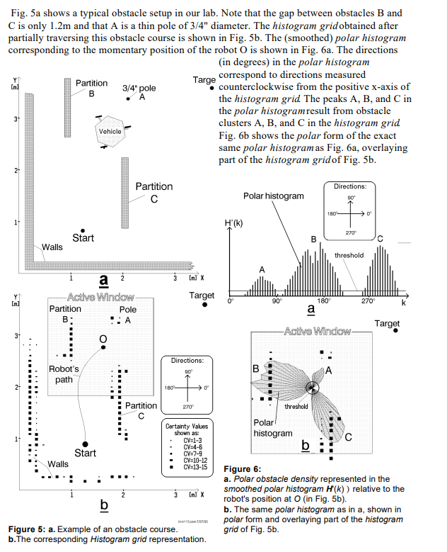
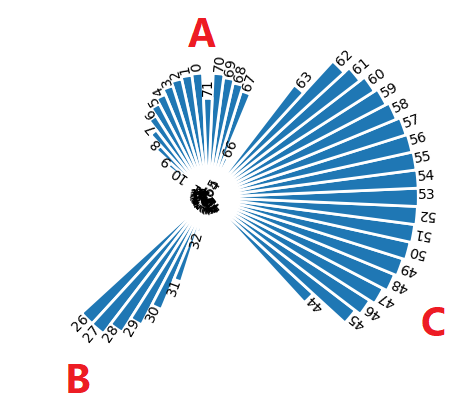

# Obstacle Avoidance with VFH Algorithm

## Overview

This project focuses on implementing obstacle avoidance using the Vector Field Histogram (VFH) algorithm. We aim to develop a robust system that allows a mobile robot to navigate through complex environments, avoiding obstacles effectively by utilizing VFH-based decision-making.

## Project Description

In this project, we leverage the power of the VFH algorithm for efficient obstacle avoidance. Our key objectives include:

- **VFH Algorithm**: We implement the VFH algorithm, which provides a real-time method for obstacle detection and path planning.

- **Sensor Integration**: We integrate LiDAR to collect environment data crucial for obstacle detection.

- **Autonomous Navigation**: The mobile robot autonomously computes optimal paths using VFH and avoids obstacles to reach its destination safely.

- **Threshold Visualization**: We provide visualizations of the VFH algorithm's threshold values, valleys, and peaks to help users understand the decision-making process.

## VFH Algorithm in Action

*Above: An illustration of the VFH algorithm in action from its original paper, showing threshold values and obstacle avoidance.*

## Project Workflow

1. **Sensor Data Collection**: The robot collects sensor data, such as distance measurements, from its surroundings.

2. **VFH Computation**: The VFH algorithm processes the sensor data to calculate threshold values, valleys, and peaks in the polar histogram.

3. **Obstacle Detection**: Obstacles are detected based on the threshold values and mapped to the polar histogram.

4. **Path Planning**: The VFH algorithm determines a collision-free path for the robot by selecting a steering angle with the lowest cost.

5. **Obstacle Avoidance**: The robot navigates autonomously using PID controller, avoiding obstacles and reaching its destination safely.

## Use Cases

- **Robotics Research**: Researchers and developers can utilize the VFH algorithm for obstacle avoidance experiments and simulations.

- **Autonomous Vehicles**: VFH-based obstacle avoidance is crucial for autonomous vehicles operating in complex urban environments.

- **Agricultural Robotics**: Robots in agriculture can utilize VFH to navigate through fields and avoid obstacles like crops and trees.

## Getting Started

To get started with this project, you'll need:

- A mobile robot platform equipped with suitable sensors for obstacle detection.

- Familiarity with the Robot Operating System (ROS) and the VFH algorithm.

- Access to environment data to test obstacle avoidance.

## Visualizing VFH

*Above: Visual representation of threshold peaks and valleys in the VFH algorithm.*

## License

This project is open-source and available under the [MIT License](LICENSE.md). You are free to use, modify, and distribute it according to the terms of the license.